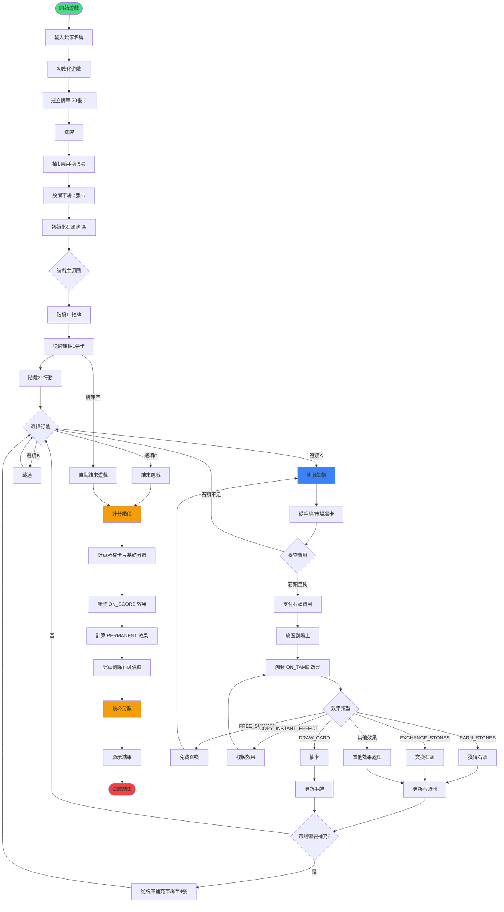

# 永恆之谷 - 遊戲流程圖
## Game Flow Diagram

## 遊戲階段說明

### 1. 遊戲初始化
- 輸入玩家名稱（單人模式）
- 建立 70 張卡片牌庫
- 洗牌
- 抽取初始手牌 5 張
- 設置市場 4 張卡片
- 初始化空石頭池

### 2. 主要遊戲迴圈

#### 階段 1: 抽牌
- 從牌庫抽 1 張卡到手牌
- 如果牌庫空，自動進入結束遊戲

#### 階段 2: 行動
玩家可以選擇：
- **馴服生物**：從手牌或市場選擇卡片，支付石頭費用後放置到場上
- **跳過**：不進行任何動作，繼續下一輪
- **結束遊戲**：主動結束，進入計分

### 3. 馴服流程
1. 選擇卡片（手牌或市場）
2. 檢查是否有足夠石頭支付費用
3. 支付石頭費用
4. 將卡片放置到場上
5. 觸發 ON_TAME 即時效果
6. 處理效果結果
7. 補充市場至 4 張

### 4. 效果系統

#### 即時效果 (⚡ ON_TAME)
觸發時機：卡片被馴服時
- `EARN_STONES` - 獲得石頭
- `DRAW_CARD` - 抽卡
- `EXCHANGE_STONES` - 交換石頭類型
- `FREE_SUMMON` - 免費召喚另一張卡
- `COPY_INSTANT_EFFECT` - 複製其他卡的即時效果
- 等 38 種效果類型

#### 永久效果 (∞ PERMANENT)
持續時間：卡片在場上期間一直有效
- `INCREASE_STONE_VALUE` - 提升石頭價值
- `DECREASE_COST` - 降低召喚費用
- `EARN_ON_SUMMON` - 每次召喚時獲得石頭
- `RECOVER_CARD` - 可被回收

#### 計分效果 (⌛ ON_SCORE)
觸發時機：遊戲結束計分時
- `EARN_PER_ELEMENT` - 每張同元素卡加分
- `EARN_PER_FAMILY` - 每個家族加分
- `CONDITIONAL_AREA` - 根據場上卡數量加分

### 5. 計分階段
1. 計算所有場上卡片的基礎分數
2. 觸發所有 ON_SCORE 效果
3. 計算所有 PERMANENT 效果的分數加成
4. 計算剩餘石頭的價值
5. 加總得出最終分數
6. 顯示結果

## 石頭經濟系統

### 石頭類型
- **數字石頭**：1️⃣ (1點), 3️⃣ (3點), 6️⃣ (6點)
- **元素石頭**：💧 (水), 🔥 (火), 🌳 (土), 🌸 (風)

### 石頭操作
- **獲得** - 從卡片效果獲得石頭
- **支付** - 召喚卡片時支付石頭
- **交換** - 轉換石頭類型
- **增值** - 永久提升石頭價值
- **轉分** - 結束時轉換為分數

### 石頭價值
- 基礎價值由永久效果修改
- 計分時所有剩餘石頭轉為分數
- 某些卡片可以提早棄掉石頭換分數

## 關鍵設計

### 單人模式特點
- 無對手互動
- 專注於資源管理和 combo 構築
- 目標：盡可能獲得高分
- 策略性：平衡石頭累積與卡片召喚

### 遊戲結束條件
1. **主動結束**：玩家選擇結束遊戲
2. **自動結束**：牌庫抽完自動結束

### 難度來源
- 石頭管理：何時花費、何時累積
- 卡片選擇：市場 vs 手牌
- 時機掌握：何時結束遊戲以獲得最高分
- Combo 構築：利用卡片效果互動創造高分

---

**版本**: v3.0.0
**更新日期**: 2025-12-30
**遊戲模式**: 單人模式
**卡片數量**: 70 張
**石頭類型**: 7 種
**效果類型**: 38 種
