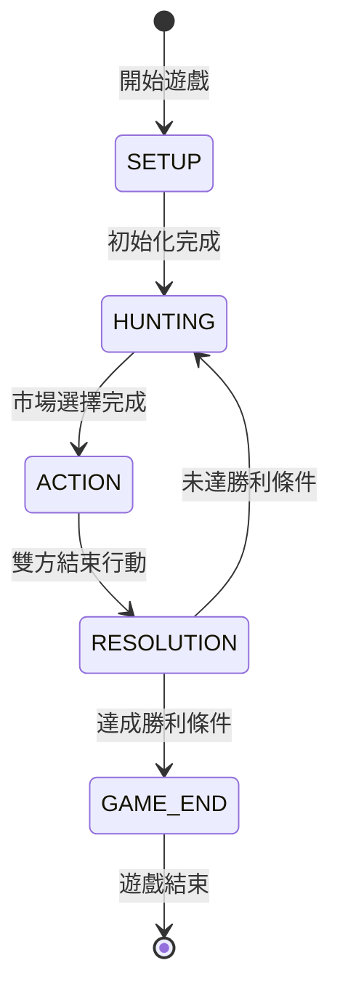

# MVP 1.0 功能規格書

> **The Vale of Eternity - 永恆之谷**
> 版本：MVP 1.0
> 最後更新：2024-12-30

---

## 1. 專案概述

### 1.1 MVP 目標

建立可運行的雙人對戰卡牌遊戲原型，驗證核心遊戲機制的正確性。

### 1.2 核心範圍

| 項目 | 規格 |
|------|------|
| 玩家數量 | 2 人（固定） |
| 卡片數量 | 20 張簡化卡片 |
| 遊戲回合 | 最多 10 回合 |
| 勝利條件 | 達到 60 分或 10 回合結束 |
| 動畫效果 | 無（專注功能驗證） |
| 教學系統 | 無（假設玩家懂規則） |
| 網路同步 | 無（本地單機雙人） |

### 1.3 不在範圍內

- AI 對戰模式
- Firebase 即時同步
- 音效與音樂
- 複雜動畫效果
- 3-4 人遊戲模式
- 擴充卡片包
- 排行榜系統
- 玩家配對系統

---

## 2. 簡化遊戲規則

### 2.1 遊戲設定

```
初始石頭（Gold）: 0 顆
石頭上限: 3 顆（可被卡片效果增加）
初始手牌: 0 張
場上卡片上限: 12 張
市場卡片數: 4 張
```

### 2.2 回合流程

每個回合分為三個階段，兩位玩家同時進行：

#### 階段一：狩獵階段 (Hunting Phase)

1. 補充市場至 4 張卡片
2. 玩家輪流從市場選擇卡片：
   - 選擇順序由上一回合分數較低者優先
   - 第一回合隨機決定先後
3. 選擇方式：
   - **免費獲得**：將卡片加入手牌
   - **馴服**：支付石頭將卡片直接放入場上

#### 階段二：行動階段 (Action Phase)

玩家輪流執行行動，每回合可執行以下動作各一次：

| 動作 | 說明 |
|------|------|
| 馴服卡片 | 從手牌支付石頭將卡片放入場上 |
| 出售卡片 | 將手牌中的卡片棄置，獲得等同費用的石頭 |
| 使用能力 | 觸發場上卡片的啟動效果 |
| 跳過 | 結束本回合行動 |

#### 階段三：結算階段 (Resolution Phase)

1. 觸發所有「回合結束」效果
2. 計算本回合得分
3. 獲得石頭（每回合固定獲得 1 顆）
4. 檢查勝利條件

### 2.3 石頭系統

- 每回合開始獲得 1 顆石頭
- 出售卡片獲得等同費用的石頭
- 馴服卡片消耗石頭
- 石頭有上限（初始 3 顆，可透過卡片效果增加）

### 2.4 卡片費用與馴服

| 卡片費用 | 馴服花費（石頭） |
|----------|------------------|
| 0 | 0 |
| 1 | 1 |
| 2 | 1 |
| 3 | 2 |
| 4 | 2 |
| 5 | 3 |
| 6+ | 3 |

### 2.5 勝利條件

遊戲在以下情況結束：

1. **達到目標分數**：任一玩家達到 60 分
2. **回合耗盡**：完成第 10 回合

勝利判定：
- 分數較高者獲勝
- 平手時，場上卡片較多者獲勝
- 仍平手則共同勝利

---

## 3. MVP 卡片清單（20 張）

### 3.1 卡片選擇原則

1. 選擇效果最簡單、直接的卡片
2. 避免複雜的連鎖效果
3. 每個家族 4 張（共 5 個家族）
4. 優先選擇「永久效果」和「即時效果」類型

### 3.2 火家族 (Fire) - 4 張

| ID | 名稱 | 費用 | 分數 | 效果類型 | 效果說明 |
|----|------|------|------|----------|----------|
| F001 | Hestia 赫斯提亞 | 0 | 0 | 永久 | 石頭上限 +2 |
| F002 | Imp 小惡魔 | 1 | 2 | 無 | - |
| F003 | Firefox 火狐 | 2 | 3 | 計分 | 每張火卡 +1 分 |
| F004 | Salamander 火蜥蜴 | 3 | 4 | 即時 | 馴服時獲得 2 顆石頭 |

### 3.3 水家族 (Water) - 4 張

| ID | 名稱 | 費用 | 分數 | 效果類型 | 效果說明 |
|----|------|------|------|----------|----------|
| W001 | Kappa 河童 | 1 | 2 | 無 | - |
| W002 | Yuki Onna 雪女 | 2 | 3 | 計分 | 每張水卡 +1 分 |
| W003 | Undine 水精靈 | 3 | 5 | 無 | - |
| W004 | Sea Spirit 海之靈 | 4 | 4 | 即時 | 馴服時抽 1 張手牌（從棄牌堆） |

### 3.4 土家族 (Earth) - 4 張

| ID | 名稱 | 費用 | 分數 | 效果類型 | 效果說明 |
|----|------|------|------|----------|----------|
| E001 | Young Forest Spirit 幼年森靈 | 0 | 1 | 無 | - |
| E002 | Goblin 哥布林 | 1 | 2 | 無 | - |
| E003 | Forest Spirit 森林精靈 | 3 | 4 | 計分 | 每張土卡 +1 分 |
| E004 | Gargoyle 石像鬼 | 4 | 6 | 無 | - |

### 3.5 風家族 (Wind) - 4 張

| ID | 名稱 | 費用 | 分數 | 效果類型 | 效果說明 |
|----|------|------|------|----------|----------|
| A001 | Harpy 鷹身女妖 | 1 | 2 | 無 | - |
| A002 | Pegasus 飛馬 | 2 | 3 | 即時 | 馴服時獲得 1 顆石頭 |
| A003 | Sylph 風精靈 | 3 | 4 | 計分 | 每張風卡 +1 分 |
| A004 | Tengu 天狗 | 4 | 5 | 無 | - |

### 3.6 龍家族 (Dragon) - 4 張

| ID | 名稱 | 費用 | 分數 | 效果類型 | 效果說明 |
|----|------|------|------|----------|----------|
| D001 | Dragon Egg 龍蛋 | 0 | 0 | 永久 | 每張龍卡 +2 分 |
| D002 | Ember 熾焰龍 | 4 | 5 | 計分 | 每張火卡 +2 分 |
| D003 | Tidal 潮汐龍 | 4 | 5 | 計分 | 每張水卡 +2 分 |
| D004 | Boulder 磐石龍 | 5 | 7 | 無 | - |

---

## 4. 效果類型定義

### 4.1 效果分類

| 類型 | 觸發時機 | 說明 |
|------|----------|------|
| 無 | - | 僅提供基礎分數 |
| 即時 | 馴服時 | 卡片進入場上時立即觸發一次 |
| 永久 | 持續生效 | 只要在場上就持續生效 |
| 計分 | 分數結算時 | 計算分數時額外加分 |

### 4.2 MVP 支援的效果

```typescript
enum EffectType {
  NONE = 'NONE',           // 無效果
  GAIN_STONES = 'GAIN_STONES',     // 獲得石頭
  INCREASE_STONE_LIMIT = 'INCREASE_STONE_LIMIT', // 增加石頭上限
  SCORE_PER_ELEMENT = 'SCORE_PER_ELEMENT',   // 每張同元素卡加分
  SCORE_PER_DRAGON = 'SCORE_PER_DRAGON',    // 每張龍卡加分
  DRAW_FROM_DISCARD = 'DRAW_FROM_DISCARD',   // 從棄牌堆抽牌
}
```

---

## 5. 遊戲流程狀態機

### 5.1 遊戲階段

```
SETUP → HUNTING → ACTION → RESOLUTION → (HUNTING 或 GAME_END)
```

### 5.2 狀態轉換



### 5.3 回合結構

```typescript
interface Round {
  number: number;           // 回合數 (1-10)
  phase: 'HUNTING' | 'ACTION' | 'RESOLUTION';
  currentPlayer: 0 | 1;     // 當前行動玩家
  marketCards: Card[];      // 市場卡片
  actionsThisRound: Action[]; // 本回合已執行動作
}
```

---

## 6. 驗收標準

### 6.1 功能驗收

| 編號 | 驗收項目 | 驗收條件 |
|------|----------|----------|
| AC-01 | 遊戲初始化 | 能正確初始化 2 位玩家的遊戲狀態 |
| AC-02 | 市場機制 | 能正確顯示 4 張市場卡片並進行選擇 |
| AC-03 | 石頭系統 | 石頭獲得、消耗、上限機制正確運作 |
| AC-04 | 卡片馴服 | 能支付石頭將卡片放入場上 |
| AC-05 | 卡片出售 | 能出售手牌獲得石頭 |
| AC-06 | 即時效果 | 馴服卡片時正確觸發即時效果 |
| AC-07 | 永久效果 | 場上卡片的永久效果持續生效 |
| AC-08 | 計分效果 | 結算時正確計算計分效果 |
| AC-09 | 分數計算 | 能正確累計並顯示雙方分數 |
| AC-10 | 回合流轉 | 三個階段能正確流轉 |
| AC-11 | 勝利判定 | 達到 60 分或 10 回合時正確判定勝負 |
| AC-12 | 遊戲重開 | 遊戲結束後能重新開始 |

### 6.2 UI 驗收

| 編號 | 驗收項目 | 驗收條件 |
|------|----------|----------|
| UI-01 | 遊戲版面 | 清楚顯示雙方場地、手牌、市場 |
| UI-02 | 回合資訊 | 顯示當前回合數和階段 |
| UI-03 | 石頭顯示 | 顯示雙方石頭數量和上限 |
| UI-04 | 分數顯示 | 顯示雙方當前分數 |
| UI-05 | 卡片資訊 | 點擊卡片能查看詳細資訊 |
| UI-06 | 操作提示 | 顯示當前可執行的操作 |
| UI-07 | 結果畫面 | 遊戲結束時顯示勝負結果 |

### 6.3 技術驗收

| 編號 | 驗收項目 | 驗收條件 |
|------|----------|----------|
| TEC-01 | 無 Console 錯誤 | 遊戲過程中無 JavaScript 錯誤 |
| TEC-02 | TypeScript | 所有程式碼通過 TypeScript 檢查 |
| TEC-03 | 響應式 | 支援桌面瀏覽器（1280x720 以上） |
| TEC-04 | 狀態管理 | 使用 Zustand 管理遊戲狀態 |
| TEC-05 | 版本號 | Console 輸出版本號 MVP 1.0.0 |

---

## 7. 技術架構

### 7.1 專案結構

```
src/
├── components/
│   ├── game/              # 遊戲核心元件
│   │   ├── GameBoard.tsx      # 遊戲主版面
│   │   ├── MarketArea.tsx     # 市場區域
│   │   ├── PlayerArea.tsx     # 玩家區域
│   │   ├── CardDisplay.tsx    # 卡片顯示
│   │   ├── StoneCounter.tsx   # 石頭計數器
│   │   ├── ScoreDisplay.tsx   # 分數顯示
│   │   ├── PhaseIndicator.tsx # 階段指示器
│   │   └── ActionPanel.tsx    # 操作面板
│   └── ui/                # 通用 UI 元件
├── engine/                # 遊戲引擎
│   ├── GameEngine.ts          # 遊戲引擎主類
│   ├── PhaseManager.ts        # 階段管理
│   ├── ActionProcessor.ts     # 動作處理
│   ├── ScoreCalculator.ts     # 分數計算
│   └── EffectResolver.ts      # 效果解析
├── data/
│   ├── cards/                 # 卡片資料
│   │   └── mvpCards.ts        # MVP 20張卡片
│   └── constants.ts           # 遊戲常數
├── stores/
│   └── useGameStore.ts        # 遊戲狀態
├── types/
│   └── mvp.ts                 # MVP 專用類型
└── pages/
    └── Game.tsx               # 遊戲頁面
```

### 7.2 狀態管理

```typescript
interface MVPGameState {
  // 遊戲基本資訊
  gameId: string;
  phase: GamePhase;
  round: number;
  currentPlayer: 0 | 1;

  // 玩家狀態
  players: [PlayerState, PlayerState];

  // 卡片區域
  deck: Card[];
  market: Card[];
  discardPile: Card[];

  // 操作紀錄
  actionLog: Action[];

  // 遊戲結果
  isGameOver: boolean;
  winner: 0 | 1 | null;
}
```

---

## 8. 開發里程碑

### Phase 1：基礎架構 (2 天)

- [ ] 建立 MVP 類型定義
- [ ] 實作 20 張卡片資料
- [ ] 建立遊戲引擎骨架
- [ ] 實作基礎 UI 元件

### Phase 2：遊戲機制 (3 天)

- [ ] 實作狩獵階段
- [ ] 實作行動階段
- [ ] 實作結算階段
- [ ] 實作石頭系統

### Phase 3：效果系統 (2 天)

- [ ] 實作即時效果
- [ ] 實作永久效果
- [ ] 實作計分效果
- [ ] 整合效果解析器

### Phase 4：遊戲流程 (2 天)

- [ ] 實作回合流轉
- [ ] 實作勝利判定
- [ ] 實作遊戲結束畫面
- [ ] 實作重新開始功能

### Phase 5：測試與修正 (1 天)

- [ ] 功能測試
- [ ] Bug 修正
- [ ] 驗收確認

---

## 附錄 A：參考圖示

### A.1 遊戲版面布局

```
┌─────────────────────────────────────────────────┐
│                   對手區域                       │
│  ┌─────────────────────────────────────────┐   │
│  │ 場地卡片 (最多 12 張)                     │   │
│  └─────────────────────────────────────────┘   │
│  石頭: ⬤⬤⬤ / 5    分數: 35                   │
├─────────────────────────────────────────────────┤
│                   市場區域                       │
│  ┌────┐ ┌────┐ ┌────┐ ┌────┐                    │
│  │卡片│ │卡片│ │卡片│ │卡片│                    │
│  └────┘ └────┘ └────┘ └────┘                    │
├─────────────────────────────────────────────────┤
│                   我方區域                       │
│  石頭: ⬤⬤ / 3     分數: 42                    │
│  ┌─────────────────────────────────────────┐   │
│  │ 場地卡片 (最多 12 張)                     │   │
│  └─────────────────────────────────────────┘   │
│  ┌─────────────────────────────────────────┐   │
│  │ 手牌                                      │   │
│  └─────────────────────────────────────────┘   │
├─────────────────────────────────────────────────┤
│ 回合 5/10 | 階段: 行動 | [馴服] [出售] [跳過]  │
└─────────────────────────────────────────────────┘
```

---

## 附錄 B：錯誤處理

### B.1 常見錯誤情況

| 錯誤代碼 | 情況 | 處理方式 |
|----------|------|----------|
| ERR_INSUFFICIENT_STONES | 石頭不足 | 顯示提示，禁止操作 |
| ERR_FIELD_FULL | 場地已滿 | 顯示提示，禁止馴服 |
| ERR_INVALID_PHASE | 階段不符 | 顯示提示，禁止操作 |
| ERR_NOT_YOUR_TURN | 非玩家回合 | 顯示提示，禁止操作 |
| ERR_CARD_NOT_FOUND | 卡片不存在 | 記錄錯誤，刷新狀態 |

---

> **文件結束**
> 如有疑問請參考其他規格文件或聯繫開發團隊。
